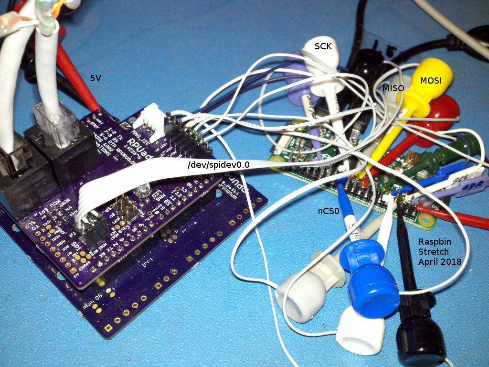
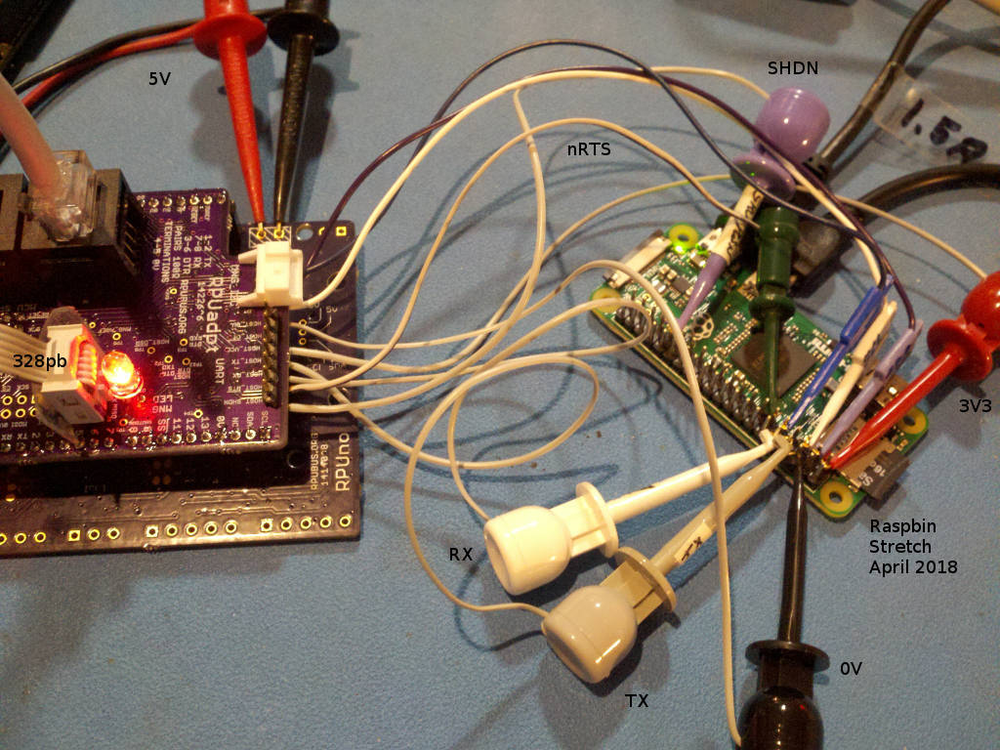
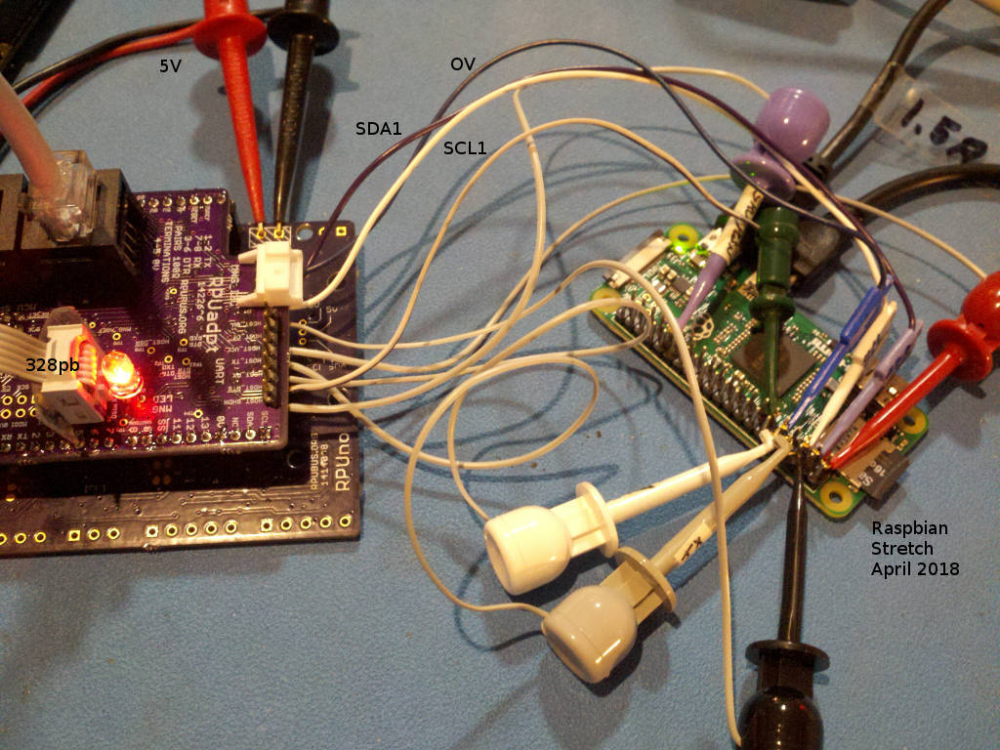
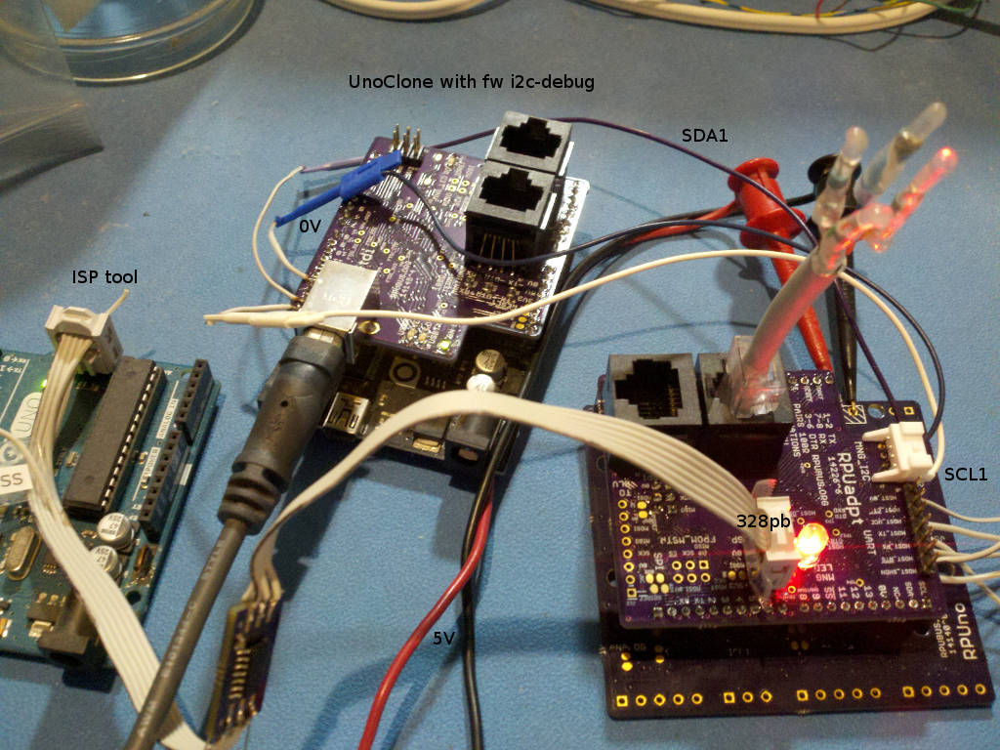
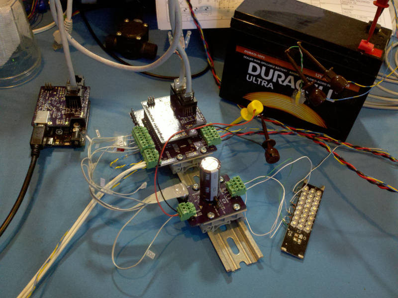
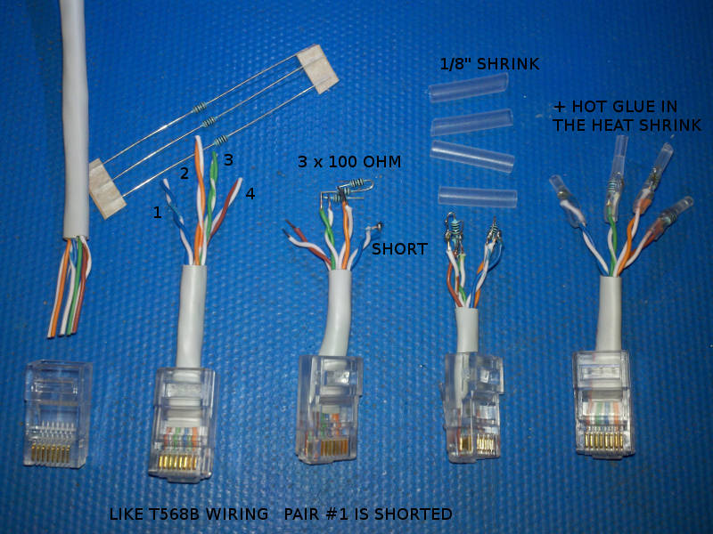

# Description

This shows the setup and method used for evaluation of RPUadpt.

# Table of References


# Table Of Contents:

1. [^6 SPI Checked With Raspberry Pi](#6-spi-checked-with-raspberry-pi)
1. [^6 Serial Checked With Raspberry Pi](#6-serial-checked-with-raspberry-pi)
1. [^6 I2C1 Checked With Raspberry Pi](#6-i2c1-checked-with-raspberry-pi)
1. [^6 I2C1 Checked With i2c-debug](#6-i2c1-checked-with-i2c-debug)
1. [^6 ISCP ATmega328pb](#6-iscp-atmega328pb)
1. [^5 Remote Reset](#5-remote-reset)
1. [^5 Bus Termination](#5-bus-termination)
1. [^5 South Wall Enclosure](#5-south-wall-enclosure)
1. [^3 Remote Bootload](#3-remote-bootload)
1. [^1 Mounts on Irrigate7](#1-mounts-on-irrigate7)
1. [^1 Mounts on Uno](#1-mounts-on-uno)
1. [^1 ICSP With Dragon](#1-icsp-with-dragon)

## ^6 SPI Checked With Raspberry Pi

The unit under test is at address '1'. So first I need to bootload its RPU controller (an RPUno^8) with [SpiSlv].

[SpiSlv]:https://github.com/epccs/RPUno/tree/master/SpiSlv

To do that I set the booload address on the shield that is connected to the host which will build [SpiSlv] and upload the firmware. Guess I will just use the new I2C1 interface to do this.

``` 
# first set user premision to use the SPI port
sudo usermod -a -G spi rsutherland
# logout for the change to take
python3
import smbus
bus = smbus.SMBus(1)
bus.write_i2c_block_data(42, 0, [0])
chr(bus.read_i2c_block_data(42,0, 2)[1])
'1'
# with command 0 on I2C1 the local address is showed as ascii '1' or 49
bus.write_i2c_block_data(42, 2, [0])
chr(bus.read_i2c_block_data(42,0, 2)[1])
'0'
# command 2 on I2C1 showed the bootload address which was '0'
# which will be canged to '1' with command 3
bus.write_i2c_block_data(42, 3, [49])
chr(bus.read_i2c_block_data(42,0, 2)[1])
'1'
bus.write_i2c_block_data(42, 7, [0])
print(bus.read_i2c_block_data(42,0, 2))
[7, 0]
# command 7 was used to clear the local status bits, the host lockout bit was set at power up.
exit()
# next check that RPU '1' is blinking fast
picocom -b 38400 /dev/ttyAMA0
...
Terminal ready
# C-a, C-x.
# now change the working directory to where SpiSlv is and then build and upload
cd ~/wher_you_told_git_to_clone/RPUno/SpiSlv
make bootload
...
avrdude done.  Thank you.
gcc -o spidev_test spidev_test.c
chmod ugo+x ./spidev_test
# trun on the RPU SPI port
picocom -b 38400 /dev/ttyAMA0
...
Terminal ready
/1/id?
{"id":{"name":"SpiSlv","desc":"RPUno (14140^9) Board /w atmega328p","avr-gcc":"4.9.2"}}
/1/spi UP
{"SPI":"UP"}
# C-a, C-x.
# test with
./spidev_test -s 1000 -D /dev/spidev0.0
./spidev_test -s 10000 -D /dev/spidev0.0
./spidev_test -s 100000 -D /dev/spidev0.0
./spidev_test -s 250000 -D /dev/spidev0.0
./spidev_test -s 500000 -D /dev/spidev0.0
# next test fail on my setup which is using a weak pullup 
# for SCK, nSS, and MOSI that input into a ATmega328p
./spidev_test -s 1000000 -D /dev/spidev0.0
./spidev_test -s 2000000 -D /dev/spidev0.0
```

The test output should look like this

```
spi mode: 0
bits per word: 8
max speed: 500000 Hz (500 KHz)

0D FF FF FF FF FF
FF 40 00 00 00 00
95 FF FF FF FF FF
FF FF FF FF FF FF
FF FF FF FF FF FF
FF DE AD BE EF BA
AD F0
``` 

The maximum speed seen is 500kHz. Adding 3k Ohm pullup on R32, R34, and R37 should allow higher speed.




## ^6 Serial Checked With Raspberry Pi

The [Remote] firmware has the Raspberry Pi locked out from using the serial connection, but with I2C1 it can be enabled. One of the status bits is for host lockout. I2C command 7 is used to set that status bit.

[Remote]: https://github.com/epccs/RPUadpt/tree/master/Remote

``` 
python3
import smbus
bus = smbus.SMBus(1)
#write_i2c_block_data(I2C_ADDR, I2C_COMMAND, DATA)
bus.write_i2c_block_data(42, 7, [0])
#read_i2c_block_data(I2C_ADDR, OFFSET, NUM_OF_BYTES)
#OFFSET is not implemented
print(bus.read_i2c_block_data(42,0, 2))
[7, 0]
exit()
picocom -b 38400 /dev/ttyAMA0
...
Terminal ready
/1/id?
# C-a, C-x.
``` 

Once the host lockout is clear the Raspberry Pi can bootload the address set with command 3 (see [Remote]). The Raspberry Pi will need to use its [RTS] handshack lines for avrdude to work.

[RTS]: https://github.com/epccs/RPUpi/tree/master/RPiRtsCts




## ^6 I2C1 Checked With Raspberry Pi

[Toggle] is a little Python program to run on a Raspberry Pi that has been setup as follows.

[Toggle]: https://github.com/epccs/RPUadpt/blob/master/BlinkLED/toggle.py

```
sudo apt-get install i2c-tools python3-smbus
sudo usermod -a -G i2c rsutherland
# logout for the change to take
i2cdetect 1
WARNING! This program can confuse your I2C bus, cause data loss and worse!
I will probe file /dev/i2c-1.
I will probe address range 0x03-0x77.
Continue? [Y/n] Y
     0  1  2  3  4  5  6  7  8  9  a  b  c  d  e  f
00:          -- -- -- -- -- -- -- -- -- -- -- -- --
10: -- -- -- -- -- -- -- -- -- -- -- -- -- -- -- --
20: -- -- -- -- -- -- -- -- -- -- 2a -- -- -- -- --
30: -- -- -- -- -- -- -- -- -- -- -- -- -- -- -- --
40: -- -- -- -- -- -- -- -- -- -- -- -- -- -- -- --
50: -- -- -- -- -- -- -- -- -- -- -- -- -- -- -- --
60: -- -- -- -- -- -- -- -- -- -- -- -- -- -- -- --
70: -- -- -- -- -- -- -- --
```

The 328pb I2C1 port is connected to the Raspberry Pi, but the data echo I got back was [0, 0xFF].

The bare metal should have returned [0, 0xFC] so what has gone wrong? Well, nothing. I sent the bare metal [0, 0x03] and the 328pb inverted the bits of the second byte for the echo that way I could see it had done something. The SMBus block read function is a second I2C transaction and it runs the twi received event a second time after the block write transaction (and before running the transmit event). Since I want to echo the data from the first transaction, I needed to preserve that old data from the first I2C transaction when (or before) the event for receiving the second transaction data occurs. Finally when the second transaction causes the transmit event I can pass the old data from the first receiving event.

So to sum it up, there seem to be two receive events and one transmit event when the Raspberry Pi does a write_i2c_block and a read_i2c_block.




## ^6 I2C1 Checked With i2c-debug

[BlinkLED] allows the I2C1 port (e.g. the secnond I2C port on ATmega328pb) to interface with a host SBC.

[BlinkLED]: https://github.com/epccs/RPUadpt/tree/master/BlinkLED

The [i2c-debug] firmware can be used to test the I2C1 port, its address is at 0x2A. The Uno clone running [i2c-debug] has another I2C interface at 0x29. 

[i2c-debug]: https://github.com/epccs/RPUno/tree/master/i2c-debug

```
picocom -b 38400 /dev/ttyUSB0
...
Terminal ready
/0/iscan?
{"scan":[{"addr":"0x29"},{"addr":"0x2A"}]}
/0/iaddr 42
{"address":"0x2A"}
/0/ibuff 0,3
{"txBuffer[2]":[{"data":"0x0"},{"data":"0x3"}]}
/0/iwrite
{"returnCode":"success"}
```

blinking has stopped

```
/0/ibuff 0
{"txBuffer[2]":[{"data":"0x0"}]}
/0/iread? 2
{"rxBuffer":[{"data":"0x0"},{"data":"0xFC"}]}
```

Note: I incuded the command byte befor reading the data because I think that is what SMBus does.




## ^6 ISCP ATmega328pb

Yes it works, but... 

There is a but. 

The Debain mainline starting at buster allows using the Atmel support packages, so that is what I am doing, check a Makefile to see how it is used. Also avr-libc assumes one TWI port. TWSR is not defined, but we have TWSR0 and TWSR1. 

```
#define TW_STATUS   (TWSR & TW_STATUS_MASK)
```

It has a new signature and fuse at efuse bit 3 for clock failure detection, so the avrdude config needs

```
part parent "m328"
    id			= "m328pb";
    desc		= "ATmega328PB";
    signature		= 0x1e 0x95 0x16;

    ocdrev              = 1;
    
    memory "efuse"
        size = 1;
        min_write_delay = 4500;
        max_write_delay = 4500;
        read = "0 1 0 1 0 0 0 0 0 0 0 0 1 0 0 0",
               "x x x x x x x x o o o o o o o o";

        write = "1 0 1 0 1 1 0 0 1 0 1 0 0 1 0 0",
                "x x x x x x x x x x x x i i i i";
    ;
;
```

I am not using SPI or the other serial port from the manager on this board so best look at [MiniCore] for info on those.

[MiniCore]: https://github.com/MCUdude/MiniCore

When ISCP is used to program the manager its control of the shutdown pin will stop and the pin will float. The Raspberry Pi should then halt, and nothing bad should happen, but it means the Raspberry Pi can not be the ICSP tool. 


## ^5 Remote Reset

I used an RPUftdi^4 to do a remote reset of an RPUno^6 with an RPUadpt^5 shield. The RPUno was also wired to a K3^2 board. A quick video shows picocom used to do the remote reset. 

[^5 Remote Reset Video](http://rpubus.org/Video/RPUno%5E6_RPUadpt%5E5_RPUftdi%5E4_K3%5E2_RemoteReset.mp4 "^5 Remote Reset Video")



After the reset, the bootloader runs for a few seconds and then passes control to the [Solenoid] firmware which reads an address from the RPUadpt shield over I2C and cycles through each latching coil to place them in a known state. Reading the address from RPUadpt also lets the bus manager on that board broadcast a byte on the RS-485 bus management pair (DTR) that ends the lockout placed on other devices to allow a point to point bootload connection (i.e. a return to normal point to multipoint mode).

[Solenoid]: https://github.com/epccs/RPUno/tree/master/Solenoid


## ^5 Bus Termination



The RX, TX, and DTR pair need a 100 Ohm termination on each end of the CAT5 daisy chain. There are places on the board to solder the resistors, they are on the RPUftdi, but for an RPUadpt an RJ45 plug allows adding to the daisy chain without soldering. I'm going to supply this for now since it is how I'm using the RPUadpt board.


## ^5 South Wall Enclosure


It is mounted on an RPUno that controls some latching solenoids. 

I had had the previous version in the Enclosure but it had some hacks, this one is clean (though my wiring is a mess, that is not what I'm trying to show).

DTR pair is running at 250k bits/sec, and the 12MHz crystal is enabled.


## ^3 Remote Bootload

The proof of concept (e.g. Multi-Drop Remote Bootload) used [Host2Remote] firmware on a RPUftdi^3 and [i2c-debug] on its bare metal MCU board (an OSEPP Uno R3 from fry's electronics). The remote device has [Remote] firmware on a RPUadpt^3 board mounted on an Irrigate7^1 (which is an ATmega1284p with xboot). The firmware bootloaded onto the Irrigate7^1 is [BlinkLED].

[Remote Bootload Video](http://rpubus.org/Video/14145%5E3_RPU_RemoteBootload.mp4 "Remote Bootload Video")


[Host2Remote]: https://github.com/epccs/RPUftdi/tree/master/Host2Remote
[Remote]: https://github.com/epccs/RPUadpt/tree/master/Remote
[BlinkLED]: https://github.com/epccs/Irrigate7/tree/master/BlinkLED
[i2c-debug]: https://github.com/epccs/RPUno/tree/master/i2c-debug


## ^1 Mounts on Irrigate7

Check that it fits on Irrigate7 and pin functions match.


## ^1 Mounts on Uno

Check that it fits on Uno and pin functions match.


The extra pins do not interfere with Uno.


The USB and power do not interfere with Uno (note USB has been removed after this version)


## ^1 ICSP With Dragon

A little blink program done in Atmel Studio 7 to see if the ATtiny1634 ICSP was working. 


Note the ATtiny1634 was changed to ATmega328p after this version, see [Schooling](../Schooling).


