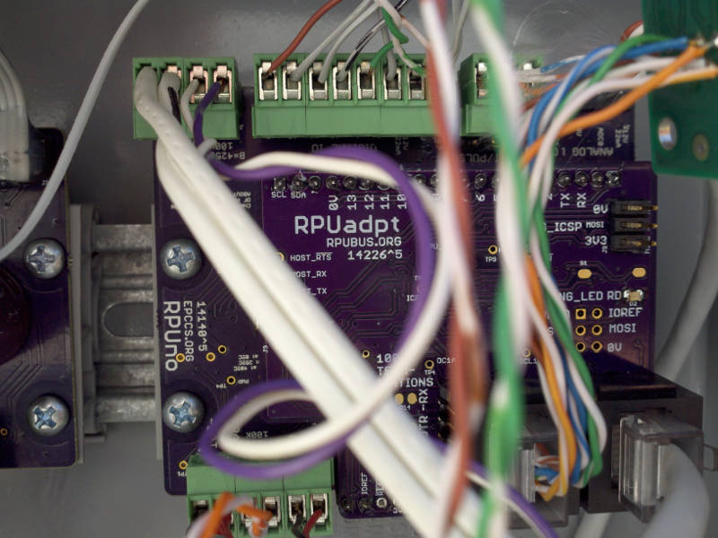
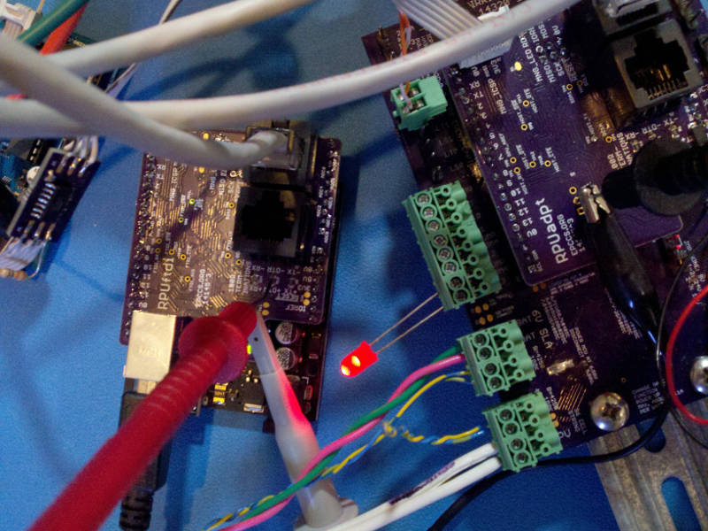
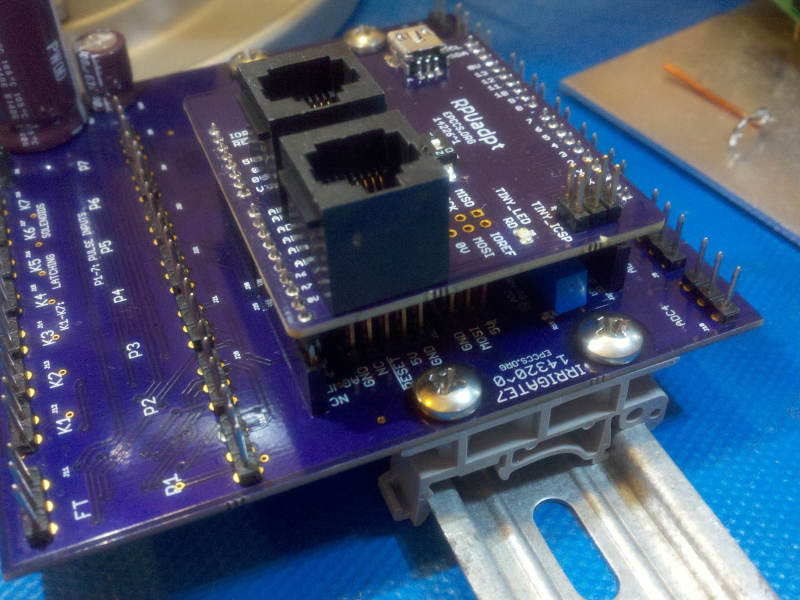
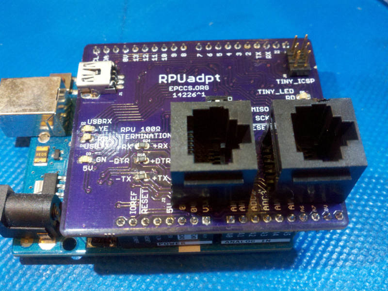
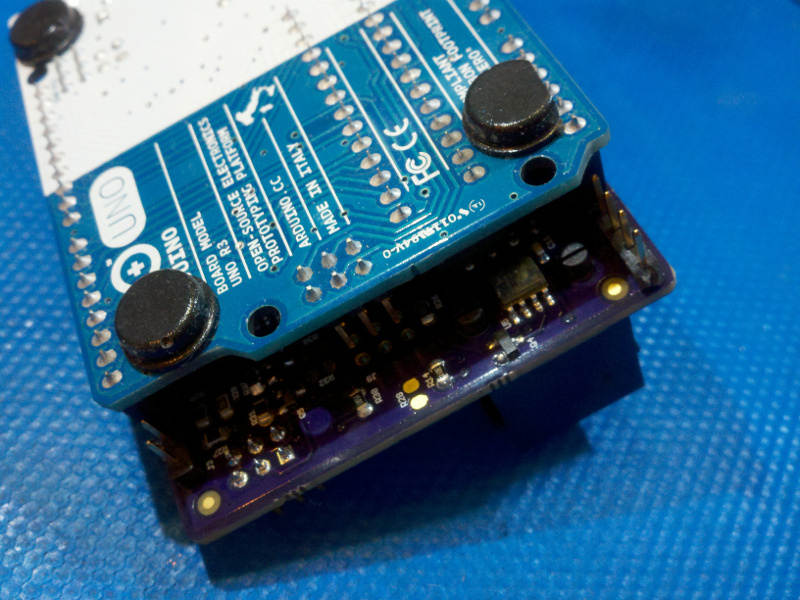
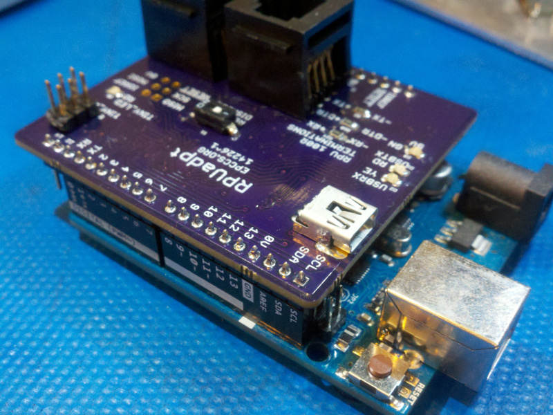
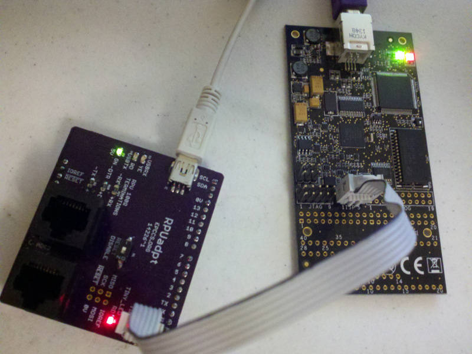

# Description

This shows the setup and method used for evaluation of RPUadpt.

# Table of References

# Table Of Contents:

5. [^5 South Wall Enclosure](#3-remote-bootload)
4. [^3 Remote Bootload](#3-remote-bootload)
3. [^1 Mounts on Irrigate7](#1-mounts-on-irrigate7)
2. [^1 Mounts on Uno](#1-mounts-on-uno)
1. [^1 ICSP With Dragon](#1-icsp-with-dragon)

## ^5 South Wall Enclosure

It is mounted on an RPUno that controls some latching solenoids. 

I had had the previous version in the Enclosure but it had some hacks, this one is clean (though my wiring is a mess, that is not what I'm trying to show).

## ^3 Remote Bootload

The proof of concept (e.g. Multi-Drop Remote Bootload) used [Host2Remote] firmware on a RPUftdi^3 and [i2c-debug] on its bare metal MCU board (an OSEPP Uno R3 from fry's electronics). The remote device has [Remote] firmware on a RPUadpt^3 board mounted on an Irrigate7^1 (which is an ATmega1284p with xboot). The firmware bootloaded onto the Irrigate7^1 is [BlinkLED].

[Remote Bootload Video](http://rpubus.org/Video/14145%5E3_RPU_RemoteBootload.mp4 "Remote Bootload Video")

[Host2Remote]: https://github.com/epccs/RPUftdi/tree/master/Host2Remote
[Remote]: https://github.com/epccs/RPUadpt/tree/master/Remote
[BlinkLED]: https://github.com/epccs/Irrigate7/tree/master/BlinkLED
[i2c-debug]: https://github.com/epccs/RPUno/tree/master/i2c-debug

## ^1 Mounts on Irrigate7

Check that it fits on Irrigate7 and pin functions match.

## ^1 Mounts on Uno

Check that it fits on Uno and pin functions match.

The extra pins do not interfere with Uno.

The USB and power do not interfere with Uno (note USB has been removed after this version)

## ^1 ICSP With Dragon

A little blink program done in Atmel Studio 7 to see if the ATtiny1634 ICSP was working. 

Note the ATtiny1634 was changed to ATmega328p after this version, see [Schooling](../Schooling).

