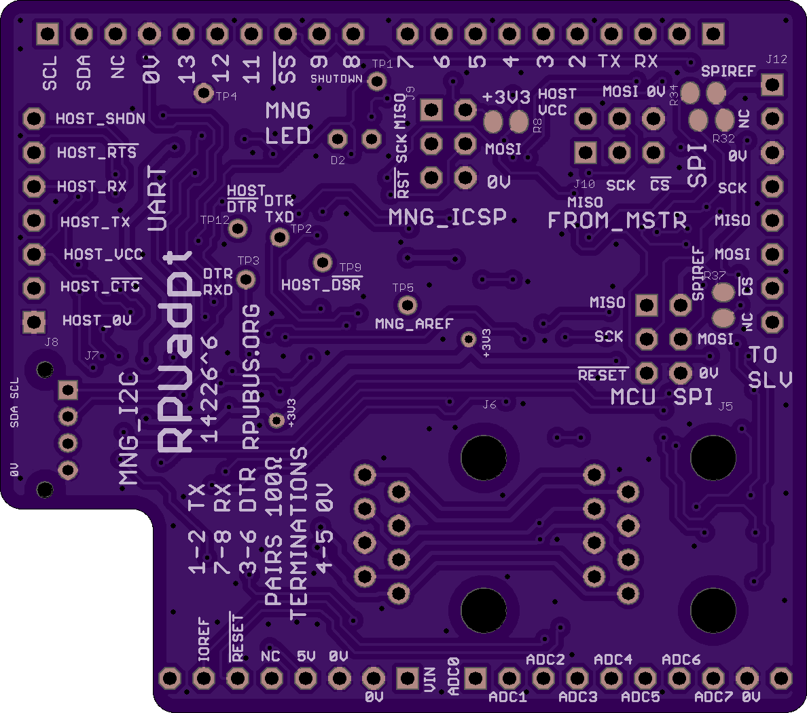
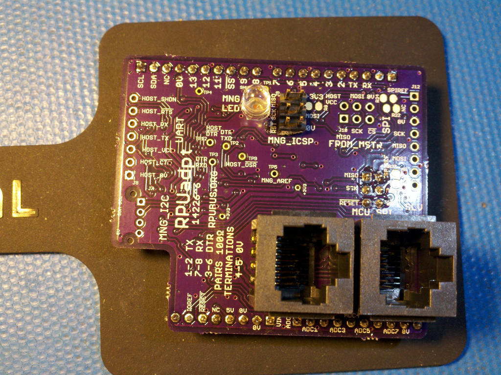
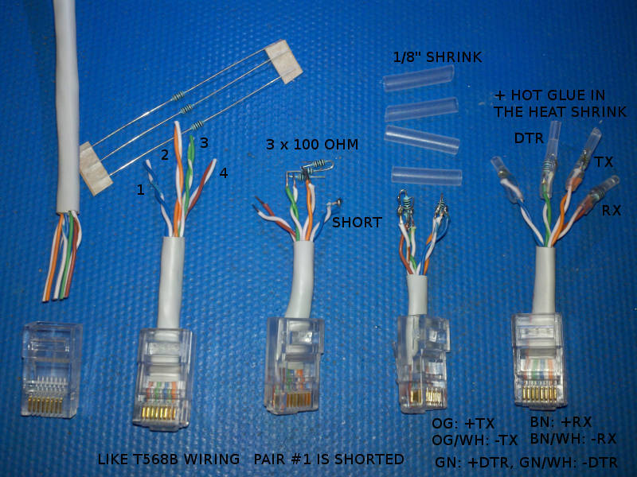

# Hardware

## Overview

This board connects a [RPUno] to a multi-drop serial bus.

[RPUno]: https://github.com/epccs/RPUno

## Inputs/Outputs/Functions

```
        TWI/I2C RPU_BUS manager interface.
        Full Duplex RS-422, multi-drop for [RPUno] RX and TX
        Half Duplex RS-485, multi-drop bus management (e.g. bootloader mode)
        Resting state from RX or TX UART causes as an undriven differential line
        Fail Safe state occurs when differential line is not driven
        Fits RPUno, Irrigate7, and PulseDAQ boards
        May also fit other Arduino Uno R3 compatible pinout.
        Power is taken from +5V of the MCU board on ^4.
        FTDI Friend pinout with 3V3 logic level for the host.
```

## Uses

```
        Daisy chain a multi-drop serial communication between RPUno's and a host.
        Example firmware [Remote] has a point to point (P2P) boatload mode.
        The bootload mode activates when the host connects. 
        Then the addressed RPUno has a P2P to receive firmware from avrdude.
```

## Notice

The serial port is a wired connection, it is immune to discovery or interference by radio. The simple hardware is raw and lacks training wheels, it should not be exposed to a network. Perhaps use SSH to forward it to a local port if needed.


# Table Of Contents

1. [Status](#status)
2. [Design](#design)
3. [Bill of Materials](#bill-of-materials)
4. [How To Use](#how-to-use) 


# Status


```
        ^5 Done: Design, Layout, BOM, Review*, Order Boards, Assembly, Testing,
           WIP: Evaluation.
           location: 2017-3-19 addr '1', SWallEncl /w K3^1, RPUno^5, SLP003-12U. 

        ^4 location: 2016-12-1 SWall Encl /w K3^0, RPUno^4, SLP003-12U. 
                     2017-1-1 RPUno^4 had ADC7 parts changed to measre battery.
                     2017-1-1 RPUno^4 had ADC6 hacked to measure raw PV.
                     2017-1-5 This^4 had ICP1 hacked open.
                     2017-3-19 scraped
```

Debugging and fixing problems i.e. [Schooling](./Schooling/)

Setup and methods used for [Evaluation](./Evaluation/)


# Design

The board is 0.063 thick, FR4, two layer, 1 oz copper with ENIG (gold) finish.





## Electrical Parameters (Typical)

```
        5V pin needs 150mA (RPUno has over 1A) to power RPU_BUS
        This is OSH so refer to the parts used for storage and operation limits.
```

## Electrical Schematic


## Testing

Check correct assembly and function with [Testing](./Testing/)


# Bill of Materials

Import the [BOM](./Design/14226,BOM.csv) into LibreOffice Calc (or Excel) with semicolon separated values, or use a text editor.


# How To Use

## ICSP

[ArduinoISP] sketch on an [Uno] with a SPI level converter is the [ICSP] tool I use to program the bus manager with the [Remote] example firmware. I then plug the RPUadpt into an RPUno and load some application firmware (e.g. [Solenoid] with [K3]). An RPUftdi and Uno clone can be used with a host to communicate with the RPUadpt and its RPUno. Additional boards will need the [Remote] firmware to have the rpu_bus address set in EEPROM.

[ArduinoISP]: https://github.com/arduino/Arduino/blob/master/build/shared/examples/11.ArduinoISP/ArduinoISP/ArduinoISP.ino
[Uno]: https://www.adafruit.com/product/50
[ICSP]: https://github.com/epccs/Driver/tree/master/ICSP
[Remote]: ../Remote
[Solenoid]: https://github.com/epccs/RPUno/tree/master/Solenoid
[K3]: https://github.com/epccs/Driver/tree/master/K3

__WARNING: The shield will be damaged if removed from a powered MCU board. Before separating the shield from the MCU board it is very important to check that all power sources are disconnected.__

The CAT5 needs wired just like an Ethernet cable following T568A (or T568B) method. http://en.wikipedia.org/wiki/Category_5_cable

Grounding should occur at one location only. If a RPUftdi is used the host frame will be connected to the local earth grounding system through USB. Unfortunately, the ground wires within CAT5 will not survive a lightning strike and will bring it to the host. To reduce the risk (and help comply with electrical code) run a #14 AWG ground wire between the remote device and the ground system connected to the host chassis. Also, the host chassis needs a good (#14 AWG or larger) wire to the same ground system (see NEC sec 250). 

The RX, TX, and DTR pair need a 100 Ohm termination on each end of the CAT5 daisy chain. There are places on the board to solder the resistors, they are on the RPUftdi, but for an RPUadpt an RJ45 plug allows adding to the daisy chain without soldering. I'm going to supply this for now since it is how I'm using the RPUadpt board.

