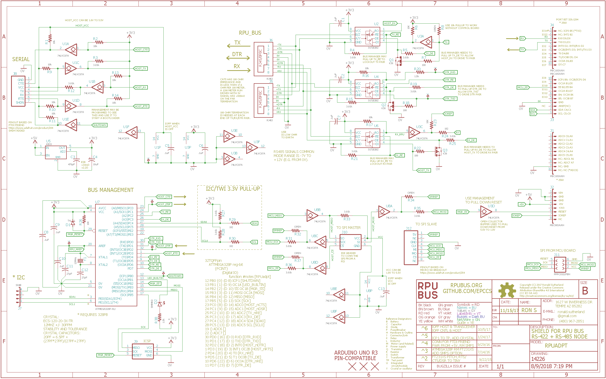

# Hardware

## Overview

This shield board plugs into a control board (e.g. [RPUno], [Irrigate7], or [Punica]) to interface it with a multi-drop serial bus. 

[RPUno]: https://github.com/epccs/RPUno
[Irrigate7]: https://github.com/epccs/Irrigate7
[Punica]: https://github.com/epccs/Punica

## Inputs/Outputs/Functions

```
        Full Duplex RS-422, multi-drop RX and TX lines
        Half Duplex RS-485, multi-drop bus management line
        The differential line is in Fail Safe state when UART is HIGH.
        Power is taken from +5V of the control board.
        TWI0 (I2C) interface between control board and manager.
        TWI1 (I2C) interface between host and manager.
        IOFF buffers are used for UART and SPI host interface.
        IOFF allows the serial and control to remain functional when the host is powered down.
        UART and SPI interface buffers work with host voltage 5V to 1.8V.
```

## Uses

```
        Daisy chain serial from multiple control boards to a host.
        Allow a point to point mode for bootloading firmware.
        Allow SPI from a local host to interface with control board.
        Allow local control board to use an SPI based MicroSD card breakout.
```

## Notice

The serial port is a wired connection, it is immune to discovery or interference by radio. The hardware is raw and lacks training wheels (i.e. it is not a polished product).


# Table Of Contents

1. [Status](#status)
2. [Design](#design)
3. [Bill of Materials](#bill-of-materials)
4. [How To Use](#how-to-use) 


# Status


```
        ^6  Done: Design, Layout, BOM,
            WIP: Review*,
            Todo: Order Boards, Assembly, Testing, Evaluation.
            *during review the Design may change without changing the revision.
            add IOFF buffer between host (e.g. offboard FTDI Friend) and tranceiver like RPUpi has
            add IOFF buffer between optional host SPI and controler like RPUpi
            add chip sellect from the host to IO10 (which has nSS, it is missing on RPUpi)
            SPI pinout can match MicroSD card breakout (https://www.adafruit.com/product/254)
            add a jumper to power the SPI from the controller (e.g. RPUno +5V)
            remove ADC6 connction to voltage divider of +5V pin.

        ^5 Done: Design, Layout, BOM, Review*, Order Boards, Assembly, Testing,
           WIP: Evaluation.
           location: 2017-3-19 addr '1', SWallEncl /w K3^1, RPUno^5, SLP003-12U. 

        ^4 location: 2016-12-1 SWall Encl /w K3^0, RPUno^4, SLP003-12U. 
                     2017-1-1 RPUno^4 had ADC7 parts changed to measre battery.
                     2017-1-1 RPUno^4 had ADC6 hacked to measure raw PV.
                     2017-1-5 This^4 had ICP1 hacked open.
                     2017-3-19 scraped
```

Debugging and fixing problems i.e. [Schooling](./Schooling/)

Setup and methods used for [Evaluation](./Evaluation/)


# Design

The board is 0.063 thick, FR4, two layer, 1 oz copper with ENIG (gold) finish.


## Electrical Parameters (Typical)

```
        5V pin needs 150mA (RPUno has over 1A) to power RPU_BUS
        This is OSH so refer to the parts used for storage and operation limits.
```

## Electrical Schematic



## Testing

Check correct assembly and function with [Testing](./Testing/)


# Bill of Materials

The BOM is a CVS file, import it into a spreadsheet program like LibreOffice Calc (or Excel), or use a text editor.

Option | BOM's included
----- | ----- 
A. | [BRD] 
M. | [BRD] [SMD] [HDR] 
Y. | [BRD] [SMD] [HDR] [CAT5]

[BRD]: ./Design/14226BRD,BOM.csv
[SMD]: ./Design/14226SMD,BOM.csv
[HDR]: ./Design/14226HDR,BOM.csv
[CAT5]: ./Design/14226CAT,BOM.csv


# How To Use

## ICSP

[ArduinoISP] sketch is on an [Uno] and a level converter (e.g. [ICSP]) is between the boards. I then run the build rule (e.g. "make isp") to program the bus manager with the [Remote] firmware. With that, I can plug the RPUadpt into an RPUno and serial bootload the controller firmware (e.g. [Solenoid] with [K3]). An RPUftdi and Uno clone can be used with a host to communicate with the RPUadpt and its controller board. Additional boards will need the [Remote] firmware to have the bus address set in EEPROM.

[ArduinoISP]: https://github.com/arduino/Arduino/blob/master/build/shared/examples/11.ArduinoISP/ArduinoISP/ArduinoISP.ino
[Uno]: https://www.adafruit.com/product/50
[ICSP]: https://github.com/epccs/Driver/tree/master/ICSP
[Remote]: ../Remote
[Solenoid]: https://github.com/epccs/RPUno/tree/master/Solenoid
[K3]: https://github.com/epccs/Driver/tree/master/K3

__WARNING: The shield will be damaged if removed from a powered MCU board. Before separating the shield from the MCU board it is very important to check that all power sources are disconnected.__

The CAT5 needs wired just like an Ethernet cable following T568A (or T568B) method. http://en.wikipedia.org/wiki/Category_5_cable

Grounding should occur at one location only. If a RPUftdi is used then the host frame will be connected to the local earth grounding system through USB. Unfortunately, the ground wires within CAT5 will not survive a lightning strike and will bring it to the host. To reduce the risk run a #14 AWG ground wire between the remote device and the ground system connected to the host chassis. Also, the host chassis needs a good (#14 AWG or larger) wire to the same ground system (see NEC sec 250). 

The RX, TX, and DTR pair need a 100 Ohm termination on each end of the CAT5 daisy chain. I'm going to supply a RJ45 plug with terminations for now.

