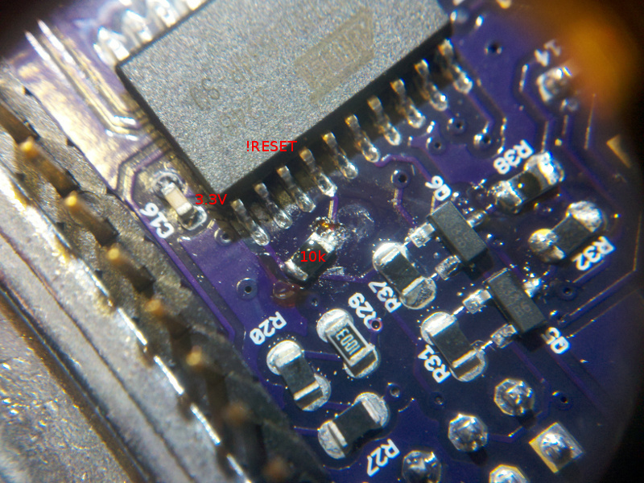

# Description

Some lessons I learned doing RPUadpt.

# Table Of Contents:

11. [^4 Bus Manager ICP1 Used to Hault Host](#4-bus-nanager-icp1-used-to-hault-host)
10. [^3 Cut VIN for RPUno^4](#3-cut-vin-for-rpuno4)
9. [^3 Pull-up HOST_TX](#3-pull-up-host_tx)
8. [^2 ATtiny1634 USI as I2C Slave](#2-attiny1634-usi-as-i2c-slave)
7. [^2 ATtiny1634 PB3 Does Not Work As Input](#2-attiny1634-pb3-does-not-work-as-input)
6. [^2 Jumper 5V as default](#2-jumper-5v-as-default)
5. [^1 Damaged Transceivers](#1-damaged-transceivers)
4. [^1 Testpoints Missing](#1-testpoints-missing)
3. [^1 FT231X Pitch](#1-ft231x-pitch)
2. [^1 ATtiny1634 !RESET 10k Pullup](#1-attiny1634-reset-10k-pullup)
1. [^0 MCU RX not Seeing Data](#0-mcu-rx-not-seeing-data)

## ^4 Bus Manager ICP1 Used to Hault Host

Connect bus manager ICP1 pin to a test point rather than DTR transceiver. RPUpi is using it to shutdown/hault the host computer.

## ^3 Cut VIN for RPUno^4

RPUno^4 VIN is powered with a 12V SLA and charge controller, it can go over 14V when cold. The RPUno^4 has a 5V SMPS. I am thinking Irrigate7 needs to be changed to a 12V SLA also. That means the RPUadpt will most likely always need to draw from the 5V supply.  

## ^3 Pull-up HOST_TX

The transceiver U6 input DI from the host is not connected to a host, but floating inputs are never a good idea. This should have a pullup added.

## ^2 ATtiny1634 USI as I2C Slave

After reviewing many library attempts, I have arrived at the unsettling conclusion that the USI implementation found in AVR Tiny chips is a bother. No one seems to have made it work reliably, except when the MCU is clocked fast (>8MHz), there are no other interrupts, or the SCL is slowed down from the master. The Mega family does not seem to suffer from these issues, I have looked at many discussions, but don't really understand the problem, and probably, more importantly, don't understand the solutions presented. I have decided it is a waste of time to try my hand with the Tiny USI as an I2C slave. This seems especially true when considering that the Mega TWI is working as a slave.

Note: the USI does seem to work as a Master e.g. [TinyWireM].

[TinyWireM]: https://github.com/adafruit/TinyWireM

## ^2 ATtiny1634 PB3 Does Not Work As Input

Yep, it is right in the Errata, which I did not notice. There is a workaround using the watchdog that enables the ULP Oscillator. 

## ^2 Jumper 5V as default

I can't think of a situation when the 5V (R37) should not be connected.

## ^1 Damaged Transceivers

I unplugged the shield from RPUno^2 with power still applied. The Battery was still connected, though I had disconnected the PV. This is the sort of problem that tripped up the original irrigation control shield when I tried to use an off the shelf Uno board. There is not a fix (other than integrating everything on one board).
    
Before separating the shield from the MCU board it is very important to step back, take a breath and double check that all power sources are disconnected. 
    
For reference Both the RX (U5) and DTR (U4) transceivers got damaged. I had been using the board for point to point RS422 only, it is an old version and does not have a bus manager.

## ^1 Testpoints Missing

During debugging and test, it is necessary to access some of the circuit nodes and solder small wires (24AWG) to the board so an oscilloscope can grab and hold on. These locations can later be used by pogo pins. 
        
The missing nodes include FTDI_TX, FTDI_RX, +3V3, and +5V.

## ^1 FT231X Pitch

I used 0.65mm pad pitch but should have used 0.635mm. It will work well enough to do some evaluations, or so I hope.

## ^1 ATtiny1634 !RESET 10k Pullup

The ATtiny1634 has a weak internal pull-up, I measured 3V with 3.3V supply and decided to add a 10k pull-up.

## ^0 MCU RX not Seeing Data

Arduino MCU does not see RX data. Channel one is the ATmega328p RX while channel two is FTDI TX output (from host computer). 

RPUftdi RS485 tranceiver output has a 1.5kOhm resistor (R13) that acts as a voltage divider with the resistor to on the on board USB interface  (Arduino has a Mega16U2 that goes through a 1kOhm resistor before arriving at the ATmega328p RX circuit node). When I change the tranceiver resistor (R13) to 180 Ohm the tranceiver is able to pull down to about 0.76V which the AVR can see as a low [logic-level] (bellow 0.9V). 

[logic-level]: https://learn.sparkfun.com/tutorials/logic-levels

RPUno does not have a USB interface so the RPUadpt tranceiver drives the ATmega328p RX circuit node with little effort.
