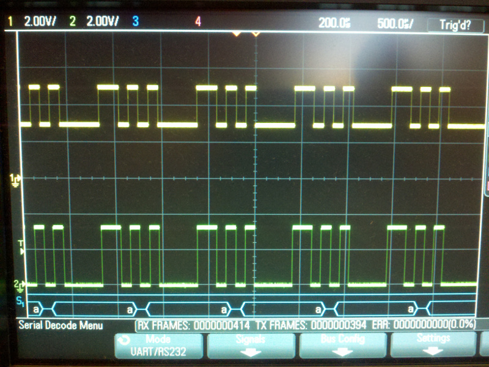

# Description

Some lessons I learned doing RPUadpt.

# Table Of Contents:

1. ^6 SMBus and the AVR I2C/TWI
1. ^6 ATmega328pb Dual I2C/TWI
1. ^6 ATmega328pb has efuse bit 3
1. ^6 AVR toolchain for ATmega328pb
1. ^5 ISP based firmware Updates
1. ^5 RJ45 Termination
1. ^4 Bus Manager ICP1 Used to Hault Host
1. ^3 Cut VIN for RPUno^4
1. ^3 Pull-up HOST_TX
1. ^2 ATtiny1634 USI as I2C Slave
1. ^2 ATtiny1634 PB3 Does Not Work As Input
1. ^2 Jumper 5V as default
1. ^1 Damaged Transceivers
1. ^1 Testpoints Missing
1. ^1 FT231X Pitch](#1-ft231x-pitch)
1. ^1 ATtiny1634 !RESET 10k Pullup
1. ^0 MCU RX not Seeing Data


## ^6 SMBus and the AVR I2C/TWI

My goal has been to use the ATmega328pb second I2C1 port as a slave for a Raspberry Pi while the first port I2C0 does that for other boards. That way I can power down the Raspberry Pi without locking up the other boards.

I find that the Raspberry Pi I2C port works with SMBus. So to experiment I have the 328pb second I2C1 port connected to a Raspberry Pi, but the data echo I got back was [0, 0xFF]. The bare metal should have returned [0, 0xFC] so what has gone wrong? Well, it actually turns out nothing. I sent the bare metal [0, 0x03] and the 328pb inverted the bits of the second byte for the echo so I would know it had done something to that byte but the SMBus read did not take place after a repeated start as I have been doing with I2C. The SMBus has some tricks that are differnt than how I have been using the I2C bus. The SMBus block read function is a second I2C transaction that runs the twi received event a second time after the block write transaction. I want to echo the data from the first transaction, so I needed to preserve that old data from the first I2C transaction when the event for receiving the second transaction data occurs. Finally when the second transaction causes a transmit event I need to pass the old data from the first receiving event. I think that is confusing but it seems to be working so I did my best to put what I found in words.

The 328pb bare metal code.

https://github.com/epccs/RPUadpt/tree/master/BlinkLED

The Python running on Raspberry Pi

https://github.com/epccs/RPUadpt/blob/master/BlinkLED/toggle.py

The Raspberry Pi setup I was using

https://github.com/epccs/RPUpi/blob/master/Hardware/Testing/linux.md


## ^6 ATmega328pb Dual I2C/TWI

I made two copies of the twi.c that I have been using and fixed all the registers to work with each of the two ports. The one issue was what to do with the switch statement for the I2C ISR

```C
switch(TW_STATUS)
```

TW_STATUS is defined in avr-libc files (#include <util/twi.h>) so I looked at what Hans did, and that made sense. So boilerplate and thanks to MCUdude.

https://github.com/MCUdude/MiniCore/tree/master/avr/libraries/Wire1/src/utility


## ^6 ATmega328pb has efuse bit 3

The bit is for clock failure detection which I am not going to use on this project. Unfortunately one of the parts I got from Digikey had the fuse set so avrdude needs told to input it during writing so it can be cleared.

https://github.com/epccs/RPUadpt/blob/master/lib/avrdude/328pb.conf

I let Hans know of the issue for MiniCore so he could decide if he wanted to include it.

https://github.com/MCUdude/MiniCore/issues/61

I also registered at savannah.nongnu.org to submit a patch. I used facchinm/avrdude Github repo to base the patch, and TortoiseGit has a diff tool that can make the patch from a Git repo.

https://savannah.nongnu.org/patch/index.php?9811


## ^6 AVR toolchain for ATmega328pb

The 5.4.0 version of avr-gcc supports Directory Search options.

https://gcc.gnu.org/onlinedocs/gcc/Directory-Options.html#Directory-Options

The ones I will use are the -B option which adds some pre-compiled binaries from Atmel's atpack. and the -I option which adds the header. The way I will use them can be seen in this MakeFile.

https://github.com/epccs/RPUadpt/blob/master/BlinkLED/Makefile

The uploader tool (avrdude) also needs a small patch, which can be appended to the systems /etc/avrdude.config with its -C option (also seen in the above Makefile).

On Jun 12, 2018 I verified that Atmel's atpack does not work with on Raspian stretch which has avr-gcc (GCC) 4.9.2

However around July 1, 2018 Raspian (stretch) has pulled the AVR toolchain from Debian sid and it now has gcc version 5.4.0 (GCC) whic does work with the atpack.


## ^5 ISP based firmware Updates

The shield is programmed with an ICSP tool. Normally I used an Arduino Uno with the [ArduinoISP] sketch from the IDE's examples. An Uno runs at 5V so I also used an SPI level shifter to program the 3.3V RPUadpt bus manager. I have a board for this, it is called [ICSP] and allows an R-Pi Zero to work as a ICSP tool host and includes SPI level shifter (and IOFF buffer).

[ArduinoISP]: https://github.com/arduino/Arduino/blob/master/build/shared/examples/11.ArduinoISP/ArduinoISP/ArduinoISP.ino
[ICSP]: https://github.com/epccs/Driver/tree/master/ICSP


## ^5 RJ45 Termination

Surface mount resistors break off the CAT5 wire when the pair is moved, so the termination needs to be a through hole part.


## ^4 Bus Manager ICP1 Used to Hault Host

Connect bus manager ICP1 pin to a test point rather than DTR transceiver. RPUpi is using it to shutdown/halt the host computer. Cut the indicated PCB trace to open the ICP1 pin.


## ^3 Cut VIN for RPUno^4

RPUno^4 VIN is powered with a 12V SLA and charge controller, it can go over 14V when cold. The RPUno^4 has a 5V SMPS. I am thinking Irrigate7 needs to be changed to a 12V SLA also. That means the RPUadpt will most likely always need to draw from the 5V supply.  


## ^3 Pull-up HOST_TX

The transceiver U6 input DI from the host is not connected to a host, but floating inputs are never a good idea. This should have a pullup added.


## ^2 ATtiny1634 USI as I2C Slave

After reviewing many library attempts, I have arrived at the unsettling conclusion that the USI implementation found in AVR Tiny chips is a bother. No one seems to have made it work reliably, except when the MCU is clocked fast (>8MHz), there are no other interrupts, or the SCL is slowed down from the master. The Mega family does not seem to suffer from these issues, I have looked at many discussions, but don't really understand the problem, and probably, more importantly, don't understand the solutions presented. I have decided it is a waste of time to try my hand with the Tiny USI as an I2C slave. This seems especially true when considering that the Mega TWI is working as a slave.

Note: the USI does seem to work as a Master e.g. [TinyWireM].

[TinyWireM]: https://github.com/adafruit/TinyWireM


## ^2 ATtiny1634 PB3 Does Not Work As Input

Yep, it is right in the Errata, which I did not notice. There is a workaround using the watchdog that enables the ULP Oscillator. 


## ^2 Jumper 5V as default

I can't think of a situation when the 5V (R37) should not be connected.


## ^1 Damaged Transceivers

I unplugged the shield from RPUno^2 with power still applied. The Battery was still connected, though I had disconnected the PV. This is the sort of problem that tripped up the original irrigation control shield when I tried to use an off the shelf Uno board. There is not a fix (other than integrating everything on one board).
    
Before separating the shield from the MCU board it is very important to step back, take a breath and double check that all power sources are disconnected. 
    
For reference Both the RX (U5) and DTR (U4) transceivers got damaged. I had been using the board for point to point RS422 only, it is an old version and does not have a bus manager.


## ^1 Testpoints Missing

During debugging and test, it is necessary to access some of the circuit nodes and solder small wires (24AWG) to the board so an oscilloscope can grab and hold on. These locations can later be used by pogo pins. 
        
The missing nodes include FTDI_TX, FTDI_RX, +3V3, and +5V.


## ^1 FT231X Pitch

I used 0.65mm pad pitch but should have used 0.635mm. It will work well enough to do some evaluations, or so I hope.


## ^1 ATtiny1634 !RESET 10k Pullup

The ATtiny1634 has a weak internal pull-up, I measured 3V with 3.3V supply and decided to add a 10k pull-up.


## ^0 MCU RX not Seeing Data

Arduino MCU does not see RX data. Channel one is the ATmega328p RX while channel two is FTDI TX output (from host computer). 



RPUftdi RS485 tranceiver output has a 1.5kOhm resistor (R13) that acts as a voltage divider with the resistor to on the on board USB interface  (Arduino has a Mega16U2 that goes through a 1kOhm resistor before arriving at the ATmega328p RX circuit node). When I change the tranceiver resistor (R13) to 180 Ohm the tranceiver is able to pull down to about 0.76V which the AVR can see as a low [logic-level] (bellow 0.9V). 

[logic-level]: https://learn.sparkfun.com/tutorials/logic-levels

RPUno does not have a USB interface so the RPUadpt tranceiver drives the ATmega328p RX circuit node with little effort.
