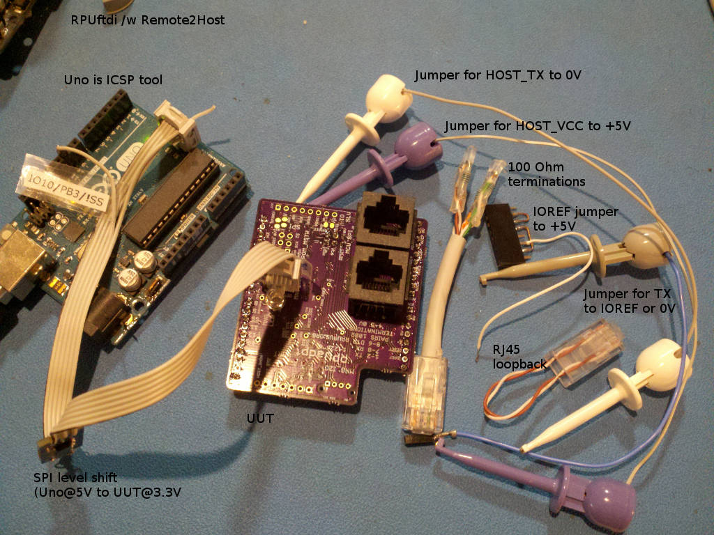

# Description

This is a list of Test preformed on each RPUadpt after assembly.

# Table of References


# Table Of Contents:

1. [Basics](#basics)
2. [Assembly check](#assembly-check)
3. [IC Solder Test](#ic-solder-test)
4. [Bias +5V and Check LDO Regulator](#bias-5v-and-check-ldo-regulator)
5. [Set MCU Fuse](#set-mcu-fuse)
6. [Load CheckDTR Firmware](#load-checkdtr-firmware)
7. [Check Differential Bias](#check-differential-bias)
8. [Differential Loopback with TX pair transceiver](#differential-loopback-with-tx-pair-transceiver)
9. [Differential Loopback with RX pair transceiver](#differential-loopback-with-rx-pair-transceiver)
10. [Load i2c-debug into an MCU board](#load-i2c-debug-into-an-mcu-board)
11. [I2C Slave test](#i2c-slave-test)


## Basics

These tests are for an assembled RPUadpt board 14226^4 which may be referred to as a Unit Under Test (UUT or DUT). If the UUT fails and can be reworked then do so, otherwise it needs to be scraped. 

**Warning: never use a soldering iron to rework ceramic capacitors due to the thermal shock.**
    
Items used for test.




## Assembly check

After assembly check the circuit carefully to make sure all parts are soldered and correct, note that the device making is labeled on the schematic and assembly drawing.
    

## IC Solder Test

Check continuity between pin and pad by measuring the reverse body diode drop from 0V (aka ground) and all other IC pads not connected to 0V. This value will vary somewhat depending on what the pin does, but there is typically an ESD diode to the ground or sometimes a body diode (e.g. open drain MOSFET), thus a value of .3V to .7V is valid to indicate a solder connection. Note the ISL3172 transceiver will show high impedance on the differential lines, so skip those.


## Bias +5V and Check LDO Regulator

Apply a 5V source set with a 30mA current limit to the +5V header pin. Check that the the MIC5205 linear regulator has 3.3V (use ICSP J9 pin2). Check that the input current is for a blank MCU (note: some pins are floating). Turn off power.


```
/^6/328pb
{   "I_IN_BLANKMCU_mA":[2.0,2.5,2.5,],
    "LDO_V":[3.299,3.307,3.284,] }
/^5/328p
{   "I_IN_BLANKMCU_mA":[2.1,2.2,2.6,2.3,2.6,],
    "LDO_V":[3.285,3.299,3.303,3.275,3.276,] }
```

## Set MCU Fuse

Install Git and AVR toolchain on Ubuntu (I use 18.04). 

```
sudo apt-get install git make gcc-avr binutils-avr gdb-avr avr-libc avrdude
```

Clone the RPUadpt repository where you want.

```
git clone https://github.com/epccs/RPUadpt
cd RPUadpt/Bootload
```

Connect a 5V supply with CC mode set at 30mA to the +5V (J7 pin 4) and  0V (J7 pin 2). Connect the ICSP tool (J9). The MCU needs its fuses set, so run the Makefile rule to do that. 

```
make fuse
```

Note: There is not a bootloader, it just sets fuses.

Disconnect the ICSP tool and measure the input current for 12Mhz crystal at 3.3V. It takes a long time to settel.

```
/^6/328pb
{   "I_IN_MCU_12MHZ_LP-CRYSTAL_mA":[8.4,8.1,8.3,]}
/^5/328p
{   "I_IN_MCU_12MHZ_LP-CRYSTAL_mA":[5.1,5.2,5.0,5.5,5.3,5.1,5.1,]}
# old values for referance
{   "I_IN_MCU_8MHZ_INTRN_mA":[4.0,4.0,4.4,4.1,4.3,]}
```


## Load CheckDTR Firmware

Plug a header (or jumper) onto the +5V pin so that IOREF is jumpered to +5V. Connect TX pin to IOREF to pull it up (the MCU normaly does this). Plug a CAT5 RJ45 stub with 100 Ohm RX, TX and DTR pair terminations. Connect a 5V supply with CC mode set at 50mA to the +5V that was jumpered to IOREF (J2 pin 4) and  0V (J2 pin 2). Connect the ICSP tool (J9).

Use the command line to select the CheckDTR source working directory. Run the makefile rule used to load CheckDTR firmware that verifies DTR control is working:

```
cd ../CheckDTR
make isp
```

The program loops through the test. It blinks the red LED to show which test number is setup. If it keeps repeating a test then that test has failed.

As the firmware loops the input current can be measured, it should have two distinct levels, one when the DTR pair is driven low and one when the DTR pair is not driven. The blinking LED leaves the DMM unsettled. Turn off power.

```
/^6/328pb
{   "DTR_HLF_LD_mA":[36.8,37.1,36.6,],
    "DTR_NO_LD_mA":[13.7,13.6,13.5,] }
/^5/328p
{   "DTR_HLF_LD_mA":[33.0,33.1,33.3,32.7,33.0,],
    "DTR_NO_LD_mA":[10.0,10.0,10.1,10.0,10.0,] }
```

Note: the ICSP tool is pluged in and has some pullups with the level shift. 


##  Check Differential Bias

Plug a header (or jumper) onto the +5V pin so that IOREF is jumpered to +5V. Plug a CAT5 RJ45 stub with 100 Ohm RX, TX and DTR pair terminations. Connect TX pin to 0V to pull it down to simulate the MCU sending data. The CheckDTR firmware will set TX_DE and RX_DE high. Connect a 5V supply with CC mode set at 100mA to the +5V that was jumpered to IOREF (J7 pin 4) and 0V (J7 pin 2). 

Check  that the input current is cycling between 56mA and 33mA. At 59mA the TX driver is driving the TX pair with half load and DTR driver is driving the DTR pair with a half load, while ony the TX pair is driven at 36mA. 

```
/^6/328pb
{   "DTR_TX_HLF_LD_mA":[59.3,59.6,59.0,],
    "TX_HLF_LD_mA":[36.4,36.2,36.0,] }
/^5/328p
{   "DTR_TX_HLF_LD_mA":[55.0,55.2,54.9,55.5,],
    "TX_HLF_LD_mA":[32.3,32.2,32.0,32.4,] }
```


## Differential Loopback with TX pair transceiver

Same as Differential Bias test with a plug in a RJ45 loopback connector to connect the TX differential pair to the RX differential pair, also same input voltage and current. The TX transceiver (U2) is now driving a differential pair with 50 Ohms on it, which is the normal load. Verify that RX has 0V on it now.

```
/^6/328pb
{   "DTR_HLF_LD_TX_FL_LD_mA":[77.0,77.0,76.7,],
    "TX_FL_LD_mA":[53.6,54.0,53.4,] }
/^5/328p
{   "DTR_HLF_LD_TX_FL_LD_mA":[72.3,72.3,72.1,72.4,],
    "TX_FL_LD_mA":[49.0,49.4,49.2,49.8,] }
```

Turn off power.


## Differential Loopback with RX pair transceiver

Disconnect TX from ground and Connect it to IOREF, which will disable the TX transceiver (U2) so that the RX transceiver (U6) can operate through the RJ45 loopback. Plug a CAT5 RJ45 stub with 100 Ohm RX, TX and DTR pair terminations. Plug in the RJ45 loopback connector so the TX pair is looped back to the RX pair. Jumper HOST_VCC (J8 pin 3) to +5V and HOST_TX (J8 pin 4) to ground to cause the RX transceiver to drive the RX pair. Measure the supply current when RX pair is driven with full load and when U4 is enabled to drive the half load on DTR pair.

```
/^6/328pb
{   "DTR_HLF_LD_RX_FL_LD_mA":[82.1,82.8,81.7,],
    "RX_FL_LD_mA":[59.3,59.3,58.9,] }
/^5/328p
{   "DTR_HLF_LD_RX_FL_LD_mA":[73.0,72.7,73.0,72.5,],
    "RX_FL_LD_mA":[50.5,49.9,49.9,49.6,] }
```


## Load i2c-debug into an MCU board

These repositories are used. 

```
git clone https://github.com/epccs/RPUadpt
git clone https://github.com/epccs/RPUftdi
git clone https://github.com/epccs/RPUno
```

Plug the RPUftdi onto a MCU board. Power both boards with a USB connection to the RPUftdi. 

Set the fuse on RPUftdi (if  needed). Connect the ICSP tool to the RPUftdi and run the Makefile rule to set the bus manager fuse.

```
cd ./RPUftdi/Bootload
make fuse
```

Load the Host2Remote firmware

```
cd ../Host2Remote
make isp
```

Plug the DUT (e.g. RPUadpt) into a second MCU board (e.g. RPUno). Connect power to the second MCU board, which will power the DUT. Connect the ICSP tool to the DUT bus manager to set the fuse on it. 

```
cd ../../RPUadpt/Bootload
make fuse
```

Load the Remote firmware.

```
cd ../Remote
make isp
```

We are done with the ICSP tool.

The default bootload address for Host2Remote is '0', which is its own address. Load the i2c-debug firmware onto the first MCU board through the RPUftdi. 

```
cd ~RPUno/i2c-debug
make bootload
```

Now change the bootload address to '1'. Connect with picocom and set the byte that is sent when DTR/RTS toggles ('1' is 0x31 or 49).

``` 
~$ picocom -b 38400 /dev/ttyUSB0
...
Terminal ready
/0/iaddr 41
{"address":"0x29"}
/0/ibuff 3,49
{"txBuffer":[{"data":"0x3"},{"data":"0x31"}]}
/0/iread? 2
{"rxBuffer":[{"data":"0x3"},{"data":"0x31"}]}
``` 

Exit picocom with C-a, C-x. This is now the bootload address that is broadcast when avrdude runs.

To check this use picocom to connect. The DUT's red MNG_LED blinks when the bus manager is addressed over the DTR pair. Exit picocom with C-a, C-x. The MNG_LED should stop blinking after picocom exits.

Now load the i2c-debug firmware onto the second MCU board under the DUT. 

```
cd ~RPUno/i2c-debug
make bootload
```


## I2C Slave test

With i2c-debug loaded in the DUT's MCU board power cycle the DUT board. If BUILTIN_LED is connected it will blink at 0.5Hz (1 sec on, and 1 sec off) when I2C reads correctly.

For reference, the RPUadpt shield address defaults to '1' and is changed with i2c-debug. The i2c-debug program reads the address during setup, so it will need a reset, remember to change the RPUftid broadcast address to '2', so the RPUadpt will reset it's MCU board.

```
~$ picocom -b 38400 /dev/ttyUSB0
...
/1/id?
{"id":{"name":"I2Cdebug","desc":"RPUno Board /w atmega328p and LT3652","avr-gcc":"4.9"}}
/1/iscan?
{"scan":[{"addr":"0x29"}]}
/1/iaddr 41
{"address":"0x29"}
/1/ibuff 1,50
{"txBuffer":[{"data":"0x1"},{"data":"0x32"}]}
/1/iread? 2
{"rxBuffer":[{"data":"0x1"},{"data":"0x32"}]}
/0/iaddr 41
{"address":"0x29"}
/0/ibuff 3,50
{"txBuffer":[{"data":"0x3"},{"data":"0x32"}]}
/0/iread? 2
{"rxBuffer":[{"data":"0x3"},{"data":"0x32"}]}
```

Exit picocom with C-a, C-x, then start it again to broadcast address '2', which will cause the DUT to reset it's MCU board and the i2c-debug program can read the address.

``` 
~$ picocom -b 38400 /dev/ttyUSB0
...
/2/iaddr 41
{"address":"0x29"}
/2/ibuff 0,255
{"txBuffer":[{"data":"0x0"},{"data":"0xFF"}]}
/2/iread? 2
{"rxBuffer":[{"data":"0x0"},{"data":"0x32"}]}
``` 
