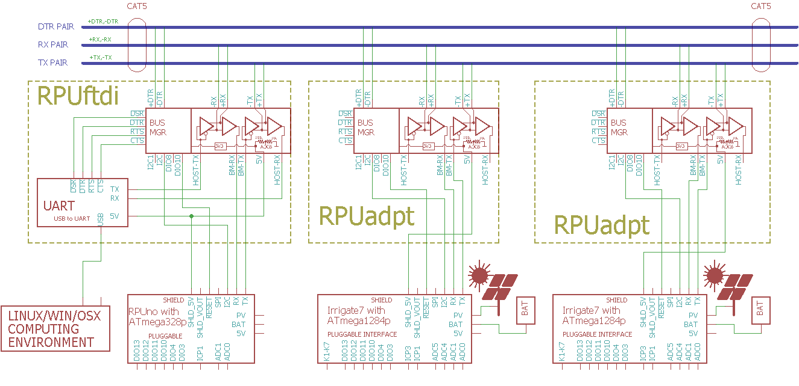

# RPUadpt (/w 328pb)

From <https://github.com/epccs/RPUadpt/>

## Overview

Shield used to connect a controller board to a multi-drop serial bus (e.g. [RPUbus]). Modular 8P8C connectors allow RJ-45 connectors and CAT5 to run the differential pairs between locations. The robust noise immunity of the differential pairs allows a host computer (e.g. Pi Zero with [RPUpi], or desktop with [USBuart]) to interface with and bootload the controller board(s) in noisy environments over serial hardware that can be physically secured.

[RPUbus]: http://rpubus.org/
[USBuart]: https://github.com/epccs/Driver/tree/master/USBuart
[RPUpi]: https://github.com/epccs/RPUpi

An SPI interface with a level shifting buffer is available between the controller and computer. SPI is also wired to an optional header for a slave device (e.g. an [SD card]) that the controller can access. 

[SD card]: https://www.adafruit.com/product/254

I2C between the manager and the controller allows its program to read an address and make the serial connection active. I2C between manager and host allows the host computer to set a bootload address even when its local controller lacks I2C interfacing software. 

[RPUno]: https://github.com/epccs/RPUno
[Irrigate7]: https://github.com/epccs/Irrigate7
[Punica]: https://github.com/epccs/Punica

[Forum](http://rpubus.org/bb/viewforum.php?f=7)

[HackADay](https://hackaday.io/project/17719-rpuadpt)

## Status

Available through [Tindie](https://www.tindie.com/products/8833/)


This shield is programmed with an in-circuit serial programming tool that is able to handle the 3.3V ATmega328p target. I use an Arduino Uno with the [ArduinoISP] sketch and an SPI level shifter (e.g. [ICSP]). A Raspberry Pi should also work with the avrdude bit-bang (-c linuxgpio) or SPI (-c linuxspi) modes.

[ICSP]: https://github.com/epccs/Driver/tree/master/ICSP

[ArduinoISP]: https://github.com/arduino/Arduino/blob/master/build/shared/examples/11.ArduinoISP/ArduinoISP/ArduinoISP.ino

## [Hardware](./Hardware)

Hardware files and notes for referance.


## Example

This multi-drop serial bus allows multiple controller boards to be connected to a host serial port (UART). Crossover of the serial from the host computer occurs as it enters the transceivers on the shield. The differential pair from the transceives is run through patch cables (CAT5) between the controllers, so all the controllers see the same interface. 

The transceivers differential driver is enabled when a UART pulls its TX output low, which means no software [magic] is needed to operate the push to talk of the transceivers, though it is up to the user software to ensure the controllers talk in a reasonable way (e.g. without collision). Since the drivers in the transceivers only output an inverted level they can't cross conduct thus collisions don't damage the hardware. I see collisions when accidentally connecting two shields with the same address and both try to answer.

[magic]: https://github.com/pyserial/pyserial/blob/master/serial/rs485.py



In the above drawing, the computer can communicate with the three controller boards (an [RPUno], an [Irrigate7], and a [Punica]). The computer connected with USB to the RPUftdi shield can access the controller boards when the manager allows. The Raspberry Pi can also access the controller boards when the manager allows. Only one host computer should access the serial bus at a time. The RS-422 can be run a significate distance (perhaps over 1000 meters). 

In my firmware examples (e.g. see [RPUno]) a command processor is used to accept textual commands over the wired interface. The examples have a simple makefile that compiles the microcontroller firmware from the source. The host computers I use have the AVR toolchain from Debian installed and can compile and upload that firmware over the serial interface with the uploader tool (avrdude). 

The firmware examples use a makefile with a bootload rule (e.g. "make bootload") that uploads to the targets bootloader. Building without a rule (e.g. "make") compiles the firmware into a relocatable elf as expected but turns that into an Intel formate hex file, the bootload rule just sends that to the uploader tool. 

When the serial port on the host opens (e.g. PySerial, picocom, or the toolchain uploader tool) it pulls the nDTR and nRTS line low (they are active low) and that tells the manager firmware ([Remote] on RPUadpt and [Host2Remote] on [RPUftdi]) to send the bootload address on the DTR pair (i.e. start its bootloader with a reset), and lockout other host. PySerial needs to wait for a few seconds while the bootloader timeout finishes (an Arduino Uno also needs to wait for this timeout).

[Remote]: https://github.com/epccs/RPUadpt/tree/master/Remote
[Host2Remote]: https://github.com/epccs/RPUftdi/tree/master/Host2Remote

The manager can see (nDTR and nRTS) the host try to connect and if it is not blocked by another host will broadcast a bootload address. When the managers see the address on the DTR pair (note the local manager will also see it) then everything sets lockout_active except if the localhost_active is set then the host remains connected and also the addressed manager remains connected and sets bootloader_started. Again the address is in the manager on the shield, so the address follows the shield. Replacing the controller (e.g. swapping an [RPUno] with an [Irrigate7]) does not change the address, but replacing the shield does (the address on the shield may be programmed).

^6 has an ATmega328pb with a second I2C port, one for the control board and the other for the host. The details of how the host will use it are not yet known. Only the single board computers with Linux (e.g. Raspberry Pi) can do things with I2C at a reasonable price. For the host, I will probably expose the commands to read the local address and set the bootload address. If the host reads the local address then sneaky mode should probably end with a normal mode broadcast on the DTR pair (but that is TBD). 

^6 also has some SPI options that need to be tested, but until an evaluation is done using it is at your own risk.


## AVR toolchain

The core files for this board are in the /lib folder. Each example has its files and a Makefile in its own folder. The toolchain packages that I use are available on Debain, Ubuntu and Raspbian. 

```
sudo apt-get install git gcc-avr binutils-avr gdb-avr avr-libc avrdude
git clone https://github.com/epccs/RPUadpt
```

* [gcc-avr](http://packages.ubuntu.com/search?keywords=gcc-avr)
* [binutils-avr](http://packages.ubuntu.com/search?keywords=binutils-avr)
* [gdb-avr](http://packages.ubuntu.com/search?keywords=gdb-avr)
* [avr-libc](http://packages.ubuntu.com/search?keywords=avr-libc)
* [avrdude](http://packages.ubuntu.com/search?keywords=avrdude)

The ATmega328pb is not in mainline, so the files from Atmel [atpack] (DFP.1.2.209.atpack) are included in this repo for use with avr-gcc (GCC) 5.4.0. At the time of this writing Raspbian has avr-gcc (GCC) 4.9.2 which does not support atpack files.

[atpack]: http://packs.download.atmel.com/
