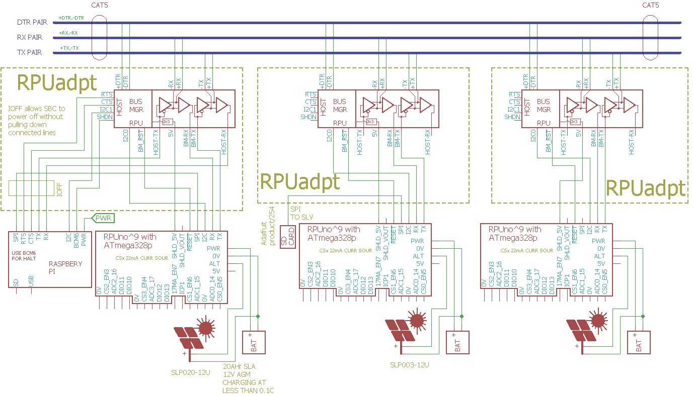

# RPUadpt

From <https://github.com/epccs/RPUadpt/>

## Overview

Shield used to connect a microcontroler to a full duplex RS-422 (RX and TX pairs) and an out of band half duplex RS-485 (DTR pair) over CAT5. Its a multidrop bus between a host (e.g. Pi Zero on [RPUpi] or desktop with [RPUftdi]) and an MCU board (e.g. [RPUno]).

[HackADay](https://hackaday.io/project/17719-rpuadpt)

[Forum](http://rpubus.org/bb/viewforum.php?f=7)

[OSHpark ^4](https://oshpark.com/shared_projects/E8B1i7ss) [OSHpark ^5](https://oshpark.com/shared_projects/2eaZ8Bau)

[RPUno]: https://github.com/epccs/RPUno
[RPUpi]: https://github.com/epccs/RPUpi
[RPUftdi]: https://github.com/epccs/RPUftdi

## Status

At this time using this shield will require programming it with an ICSP tool that is able to program a 3.3V ATmega328p target. 

## [Hardware](./Hardware)

Hardware files are in Eagle, there is also some testing, evaluation, and schooling notes for referance.

## Example

A Host computer (e.g. Pi Zero on [RPUpi] or desktop with [RPUftdi]) issues commands to the RPU_BUS microcontrollers over a serial (UART) interface. The microcontrollers run a command processor that accepts interactive textual commands that operate the microcontroller peripherals as a bare metal system. This means the microcontroller can perform event capture task for a flow meter or control an array of half-bridge power outputs to run a BLDC water pump. 

## AVR toolchain

* sudo apt-get install [gcc-avr]
* sudo apt-get install [binutils-avr]
* sudo apt-get install [gdb-avr]
* sudo apt-get install [avr-libc]
* sudo apt-get install [avrdude]
    
[gcc-avr]: http://packages.ubuntu.com/search?keywords=gcc-avr
[binutils-avr]: http://packages.ubuntu.com/search?keywords=binutils-avr
[gdb-avr]: http://packages.ubuntu.com/search?keywords=gdb-avr
[avr-libc]: http://packages.ubuntu.com/search?keywords=avr-libc
[avrdude]: http://packages.ubuntu.com/search?keywords=avrdude