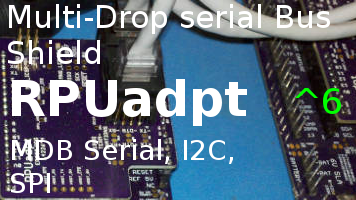

# RPUadpt

From <https://github.com/epccs/RPUadpt/>

## Overview

Shield used to connect a microcontroler to a full duplex RS-422 (RX and TX pairs) and an out of band half duplex RS-485 (DTR pair) over CAT5. Its a multidrop bus between a host (e.g. Pi Zero on [RPUpi] or desktop with [RPUftdi]) and an MCU board (e.g. [RPUno]).

[RPUno]: https://github.com/epccs/RPUno

[Forum](http://rpubus.org/bb/viewforum.php?f=7)

[HackADay](https://hackaday.io/project/17719-rpuadpt)

## Status

Available through [Tindie](https://www.tindie.com/products/ron-sutherland/rpuadpt-a-shield-for-rs-422-over-cat5/)



This shield is programmed with an in-circuit serial programming tool that is able to do a 3.3V ATmega328p target. I use an Arduino Uno with the [ArduinoISP] sketch and an SPI level shifter (e.g. [ICSP]).

[ICSP]: https://github.com/epccs/Driver/tree/master/ICSP

[ArduinoISP]: https://github.com/arduino/Arduino/blob/master/build/shared/examples/11.ArduinoISP/ArduinoISP/ArduinoISP.ino

## [Hardware](./Hardware)

Hardware files and notes for referance.


## Example

A multi-drop serial bus allows multiple microcontroller boards to be connected to a host serial port. The host computer crossover occurs on an [RPUftdi] or [RPUpi] shield. The host and microcontrollers control the transceivers differential driver automatically, which means no software [magic] is needed, though only one microcontroller should be allowed to talk. 

[RPUpi]: https://github.com/epccs/RPUpi
[RPUftdi]: https://github.com/epccs/RPUftdi
[magic]: https://github.com/pyserial/pyserial/blob/master/serial/rs485.py


In the examples, for [RPUno] a command processor is used to accept interactive textual commands and operate the peripherals. The examples have a simple makefile that compiles the microcontroller firmware from the source. The host I used has Ubuntu (or Raspbian) with the AVR toolchain installed.

The RPUno examples have a makefile with a bootload rule (e.g. "make bootload") that uploads to the targets bootloader using avrdude.

When PySerial on the host opens the serial port it pulls the nDTR line low (it is active low) and that tells the [RPUftdi] manager running [Host2Remote] firmware to reset the bootload address. PySerial needs to wait for a few seconds while the bootloader timeout finishes just like with an Arduino Uno, and is the same reason (e.g. on RS232 the same bootloader timeout is needed).

[Host2Remote]: https://github.com/epccs/RPUftdi/tree/master/Host2Remote

When avrdude opens the serial port it pulls the nDTR line low and the manager broadcast the bootload address which places everything in lockout except the host and the microcontroller board that was addressed. The address is held in the manager on the RPUadpt shield which is running [Remote] firmware. Replacing the [RPUno] dos not change the address of the location, but replacing the RPUadpt or modify its address (by I2C) does.

[Remote]: ./Remote


## AVR toolchain

The core files for this board are in the /lib folder. Each example has its files and a Makefile in its own folder. The toolchain packages that I use are available on Ubuntu and Raspbian. 

```
sudo apt-get install git [gcc-avr] [binutils-avr] [gdb-avr] [avr-libc] [avrdude]
git clone https://github.com/epccs/RPUadpt
```

[gcc-avr]: http://packages.ubuntu.com/search?keywords=gcc-avr
[binutils-avr]: http://packages.ubuntu.com/search?keywords=binutils-avr
[gdb-avr]: http://packages.ubuntu.com/search?keywords=gdb-avr
[avr-libc]: http://packages.ubuntu.com/search?keywords=avr-libc
[avrdude]: http://packages.ubuntu.com/search?keywords=avrdude